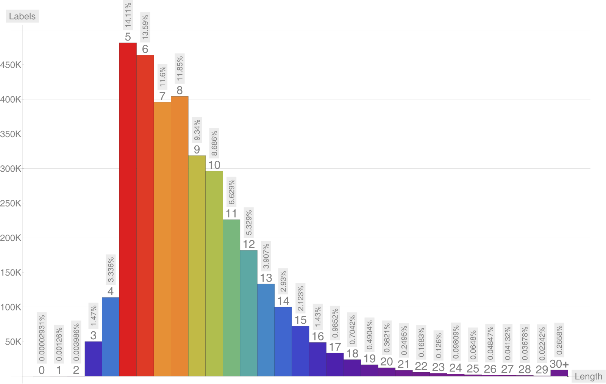

# ens-labels

<!-- summary -->
`3,406,986` unique, stop-free labels as of `2026-03-28` collected from ENS contract events and primary name records.

* [`49.0MB`](https://github.com/adraffy/ens-labels/raw/master/labels.json) — [labels.json](./labels.json) `512eea4a3446c3d3547ed8d1e3d7b8fe859b631e6c6e809001072d722d1b2261` (SHA256)
<!-- /summary -->

[**Demo**](https://adraffy.github.io/ens-labels/demo.html) ⭐

## Length Distribution

<!-- table -->
| N | # | % |
| ---: | ---: | ---: |
| 0 | 1 | 0.0000% |
| 1 | 43 | 0.0013% |
| 2 | 136 | 0.0040% |
| 3 | 50163 | 1.4724% |
| 4 | 113798 | 3.3401% |
| 5 | 481285 | 14.1264% |
| 6 | 463353 | 13.6001% |
| 7 | 395184 | 11.5992% |
| 8 | 403602 | 11.8463% |
| 9 | 318092 | 9.3365% |
| 10 | 295842 | 8.6834% |
| 11 | 225821 | 6.6282% |
| 12 | 181489 | 5.3270% |
| 13 | 133027 | 3.9045% |
| 14 | 99729 | 2.9272% |
| 15 | 72250 | 2.1206% |
| 16 | 48633 | 1.4274% |
| 17 | 33512 | 0.9836% |
| 18 | 23940 | 0.7027% |
| 19 | 16671 | 0.4893% |
| 20 | 12326 | 0.3618% |
| 21 | 8489 | 0.2492% |
| 22 | 5730 | 0.1682% |
| 23 | 4283 | 0.1257% |
| 24 | 3340 | 0.0980% |
| 25 | 2199 | 0.0645% |
| 26 | 1648 | 0.0484% |
| 27 | 1399 | 0.0411% |
| 28 | 1252 | 0.0367% |
| 29 | 762 | 0.0224% |
| 30+ | 8987 | 0.2638% |
<!-- /table -->

## Longest Labels

<!-- longest -->
| N | Bytes | Labelhash |
| ---: | ---: | :--- |
| 38894 | 38894 | [`6b65f209340a98cfe6c5fdc21be6e2b32d6855e817ab83ec6cca8da990fa8d25`](https://adraffy.github.io/ens-normalize.js/test/resolver.html#token:0x6b65f209340a98cfe6c5fdc21be6e2b32d6855e817ab83ec6cca8da990fa8d25)
| 38894 | 38894 | [`3810d408f40f56ffab7c06d105918d740af3e629f84bf03c920bc6709d3eec6d`](https://adraffy.github.io/ens-normalize.js/test/resolver.html#token:0x3810d408f40f56ffab7c06d105918d740af3e629f84bf03c920bc6709d3eec6d)
| 38894 | 38894 | [`efc93dfe2a8ca19f2795760acba6b559ac0809028ea86c4e81cd2bd786668afa`](https://adraffy.github.io/ens-normalize.js/test/resolver.html#token:0xefc93dfe2a8ca19f2795760acba6b559ac0809028ea86c4e81cd2bd786668afa)
| 38894 | 38894 | [`d0c3c77adc6d6771fa2210b31d4241a260819e1613443757a45a8a1e606ec835`](https://adraffy.github.io/ens-normalize.js/test/resolver.html#token:0xd0c3c77adc6d6771fa2210b31d4241a260819e1613443757a45a8a1e606ec835)
| 38894 | 116682 | [`51592185a7ebb018d50f7acfd13011e66d39d351af698ce9a733a724c70d0786`](https://adraffy.github.io/ens-normalize.js/test/resolver.html#token:0x51592185a7ebb018d50f7acfd13011e66d39d351af698ce9a733a724c70d0786)
| 37058 | 37058 | [`9d7b472bcba4e71d1c05daab624a4896c6d5a8b40adaf64c0006e0b5afcbe343`](https://adraffy.github.io/ens-normalize.js/test/resolver.html#token:0x9d7b472bcba4e71d1c05daab624a4896c6d5a8b40adaf64c0006e0b5afcbe343)
| 33792 | 101376 | [`81acf311f29dc4c83dd0a213468803f4befc2ce3c04bfaaf8852e801c97f2d15`](https://adraffy.github.io/ens-normalize.js/test/resolver.html#token:0x81acf311f29dc4c83dd0a213468803f4befc2ce3c04bfaaf8852e801c97f2d15)
| 32745 | 32745 | [`97f3a8086a50bd2fab79c3ab50e1cc7ffd20f46f6d6dcedb65ea0f44464a3a2d`](https://adraffy.github.io/ens-normalize.js/test/resolver.html#token:0x97f3a8086a50bd2fab79c3ab50e1cc7ffd20f46f6d6dcedb65ea0f44464a3a2d)
| 32713 | 32713 | [`f9da64a5938b21cac4a673030b71ec5c997ab401557239480661876637baf818`](https://adraffy.github.io/ens-normalize.js/test/resolver.html#token:0xf9da64a5938b21cac4a673030b71ec5c997ab401557239480661876637baf818)
| 29425 | 117700 | [`2984778431ebdb5b58239741cbd3b5d132d84eefe6b45cd7820dd4bf59e82e24`](https://adraffy.github.io/ens-normalize.js/test/resolver.html#token:0x2984778431ebdb5b58239741cbd3b5d132d84eefe6b45cd7820dd4bf59e82e24)
| 14842 | 14842 | [`ab277f834e1512b904dbf9a4e5f9f23460e356a1652c2a678752bc534e76f04d`](https://adraffy.github.io/ens-normalize.js/test/resolver.html#token:0xab277f834e1512b904dbf9a4e5f9f23460e356a1652c2a678752bc534e76f04d)
| 11111 | 11111 | [`2cc6bb5b970029045f87aed33a797e1f6f9fb05884c5ba6818fc94d0a1fda11d`](https://adraffy.github.io/ens-normalize.js/test/resolver.html#token:0x2cc6bb5b970029045f87aed33a797e1f6f9fb05884c5ba6818fc94d0a1fda11d)
| 10245 | 10245 | [`31a19c964c4f919354eab4398499668d6a598ac71597d9634b4e91a36898a3d5`](https://adraffy.github.io/ens-normalize.js/test/resolver.html#token:0x31a19c964c4f919354eab4398499668d6a598ac71597d9634b4e91a36898a3d5)
| 10000 | 10000 | [`ec5779527b23c6f203e1b248e21addf86ab5e8b61cc07404ae0f869933de9c0a`](https://adraffy.github.io/ens-normalize.js/test/resolver.html#token:0xec5779527b23c6f203e1b248e21addf86ab5e8b61cc07404ae0f869933de9c0a)
| 10000 | 10000 | [`08a34cfd9c55bd8fc8c2124be5d4ae2e26d817f07cd3b43ef2b1d363b6c110a6`](https://adraffy.github.io/ens-normalize.js/test/resolver.html#token:0x08a34cfd9c55bd8fc8c2124be5d4ae2e26d817f07cd3b43ef2b1d363b6c110a6)
| 10000 | 10000 | [`02b8be2b5ebbd2b9dfa241cc2e06905c3aebc6b93a65a996c709db5da48cf02b`](https://adraffy.github.io/ens-normalize.js/test/resolver.html#token:0x02b8be2b5ebbd2b9dfa241cc2e06905c3aebc6b93a65a996c709db5da48cf02b)
| 10000 | 30000 | [`801797b1581f72969312af85f7ac5e79b964a9525e65ba22c02d169f981b5cc2`](https://adraffy.github.io/ens-normalize.js/test/resolver.html#token:0x801797b1581f72969312af85f7ac5e79b964a9525e65ba22c02d169f981b5cc2)
| 10000 | 40000 | [`a5f1a998bbf992d1e8384c0200f003770c489b25707ecb68b1c5a5dfd0f2ad20`](https://adraffy.github.io/ens-normalize.js/test/resolver.html#token:0xa5f1a998bbf992d1e8384c0200f003770c489b25707ecb68b1c5a5dfd0f2ad20)
| 10000 | 40000 | [`736473f178e0f659e8e389f9a919f44fe95848b6ca090e7083f980e411776af4`](https://adraffy.github.io/ens-normalize.js/test/resolver.html#token:0x736473f178e0f659e8e389f9a919f44fe95848b6ca090e7083f980e411776af4)
| 9999 | 9999 | [`0a59c943ab7fea65ac5aff5fb61a58e01010b9379aa2e961b559ed3843cf6187`](https://adraffy.github.io/ens-normalize.js/test/resolver.html#token:0x0a59c943ab7fea65ac5aff5fb61a58e01010b9379aa2e961b559ed3843cf6187)
<!-- /longest -->
